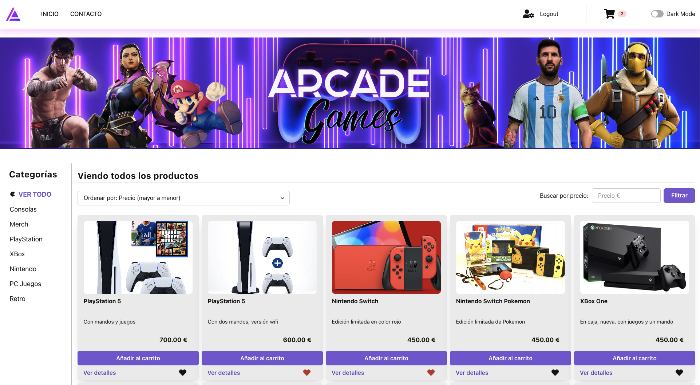
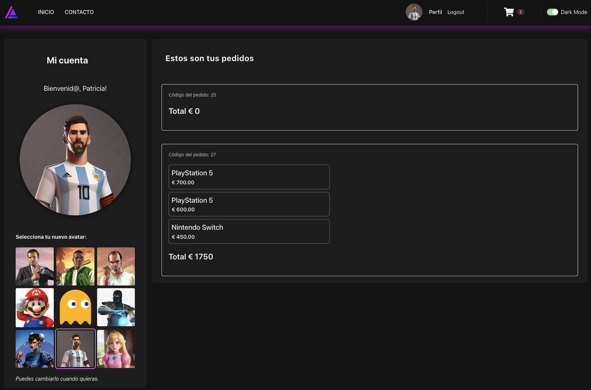
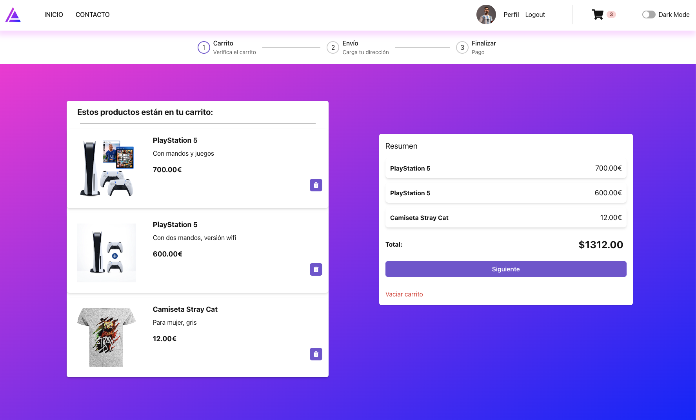
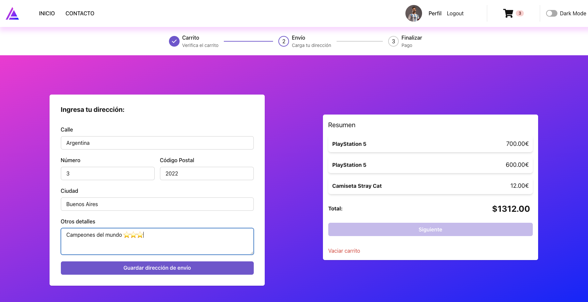
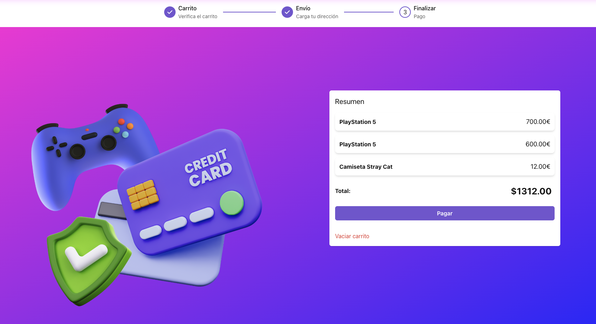
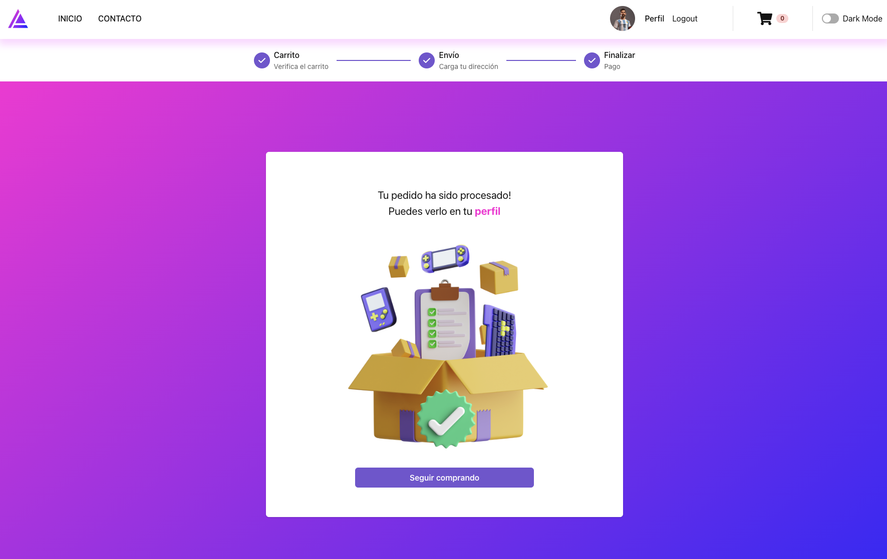

# <h1 align="center"><strong>...**-=-**.'.**-=-**.'.**-=-**. 🎮 ARCADE GAMES 🎮 .**-=-**.'.**-=-**.'.**-=-**...</strong></h1>

## <p align="center">Proyecto de desarrollo</p>


## E-Commerce de videojuegos

### 📋 Tabla de Contenidos

-   [Características](#características)
-   [Requisitos](#requisitos)
-   [Instalación](#instalación)
-   [Uso](#uso)
-   [Contribución](#contribución)
-   [Licencia](#licencia)

### 🚀 Características

-   Dinamica
-   Responsiva
-   Funcional

### 📷 Capturas de Pantalla










### ✅ Requisitos

Asegúrate de tener instalado lo siguiente:

-   Chakra UI
-   React
-   React Router

### 🛠️ Instalación

1. Clona este repositorio: `git clone https://github.com/patrigarcia/e-commerce_frontend`
2. Navega al directorio del proyecto: `cd tu-proyecto`
3. Instala las dependencias: `npm install`

## 💻 Uso

En la terminal levanta el servidor:

```bash
npm run dev
```

## 🤝 Contribución

Todas las contribuciones son bienvenidas. Por favor sigue estos pasos:

-   Haz un fork del proyecto.
-   Crea una rama con tu característica: git checkout -b caracteristica-nueva
-   Haz commit de tus cambios: git commit -m 'Añade nueva característica'
-   Empuja tu rama: git push origin caracteristica-nueva
-   Abre un Pull Request.

## 📄 Licencia

Este proyecto fue desarrollado por Patricia Gonzalez García en el Bootcamp FullStack de The Bridge. Todos los derechos reservados.
